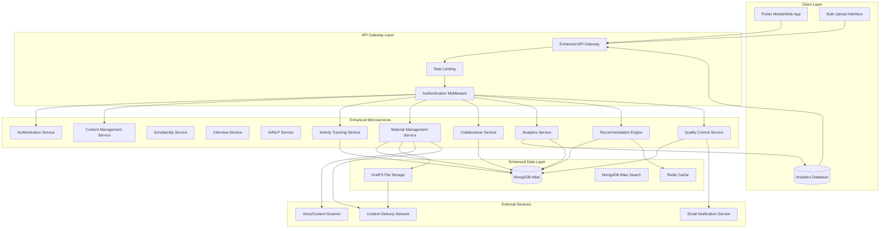

# Design Document: Enhanced Data Storage and Materials System

## Overview

The Enhanced Data Storage and Materials system extends the existing Nova Learn Platform with comprehensive MongoDB data persistence capabilities and a robust material addition system. This enhancement focuses on capturing detailed user interactions, providing sophisticated material management workflows, and enabling collaborative content creation. The system emphasizes data-driven insights, community-driven quality control, and personalized learning experiences through advanced analytics and recommendation engines.

The design builds upon the existing microservices architecture while adding new data collection layers, material workflow management, and collaborative features. The system maintains backward compatibility with existing services while providing enhanced capabilities for user activity tracking, material versioning, and community collaboration.

## Architecture

### Enhanced System Architecture



### Technology Stack Enhancements

**New Components:**
- **Activity Tracking**: Event-driven architecture with MongoDB change streams
- **File Processing**: Node.js streams with GridFS for large file handling
- **Analytics**: Time-series data collection with MongoDB aggregation pipelines
- **Search**: MongoDB Atlas Search with full-text indexing
- **Caching**: Redis for recommendation caching and session management
- **Content Delivery**: CDN integration for optimized file delivery
- **Background Processing**: Bull queue for async material processing

## Components and Interfaces

### 1. Enhanced Activity Tracking Service

**Responsibilities:**
- Comprehensive user interaction logging
- Real-time analytics data collection
- Learning pattern analysis
- Performance metrics tracking

**Key Interfaces:**
```python
class ActivityTrackingService:
    def log_user_action(user_id: str, action: UserAction, context: dict) -> LogResult
    def track_material_interaction(user_id: str, material_id: str, interaction: MaterialInteraction) -> TrackingResult
    def record_search_query(user_id: str, query: SearchQuery, results: SearchResults) -> SearchLogResult
    def capture_learning_session(user_id: str, session_data: LearningSession) -> SessionResult
    def generate_user_analytics(user_id: str, time_range: TimeRange) -> UserAnalytics
    def get_platform_metrics(filters: dict) -> PlatformMetrics
```

### 2. Enhanced Material Management Service

**Responsibilities:**
- Multi-channel material upload processing
- Rich metadata collection and validation
- Version control and change tracking
- Bulk upload coordination

**Key Interfaces:**
```python
class MaterialManagementService:
    def upload_file(file_data: FileUpload, metadata: MaterialMetadata) -> UploadResult
    def import_from_url(url: str, metadata: MaterialMetadata) -> ImportResult
    def create_text_material(content: TextContent, metadata: MaterialMetadata) -> CreationResult
    def process_bulk_upload(files: list[FileUpload], template: MetadataTemplate) -> BulkUploadResult
    def create_material_version(material_id: str, changes: MaterialChanges) -> VersionResult
    def get_version_history(material_id: str) -> VersionHistory
    def validate_material_quality(material_id: str) -> QualityReport
```

### 3. Collaboration Service

**Responsibilities:**
- Material sharing and access control
- Comment and discussion management
- Rating and review system
- Community moderation workflows

**Key Interfaces:**
```python
class CollaborationService:
    def share_material(material_id: str, sharing_config: SharingConfig) -> SharingResult
    def add_comment(material_id: str, user_id: str, comment: Comment) -> CommentResult
    def rate_material(material_id: str, user_id: str, rating: MaterialRating) -> RatingResult
    def report_content(material_id: str, user_id: str, report: ContentReport) -> ReportResult
    def moderate_content(report_id: str, moderator_id: str, action: ModerationAction) -> ModerationResult
    def get_material_discussions(material_id: str) -> DiscussionThread
    def get_community_metrics(material_id: str) -> CommunityMetrics
```

### 4. Enhanced Analytics Service

**Responsibilities:**
- User behavior analysis
- Material performance tracking
- Learning outcome correlation
- Predictive analytics for recommendations

**Key Interfaces:**
```python
class AnalyticsService:
    def analyze_user_learning_patterns(user_id: str) -> LearningPatterns
    def track_material_effectiveness(material_id: str) -> EffectivenessMetrics
    def generate_usage_reports(filters: AnalyticsFilters) -> UsageReport
    def correlate_learning_outcomes(user_id: str, materials: list[str]) -> OutcomeCorrelation
    def predict_user_engagement(user_id: str, material_id: str) -> EngagementPrediction
    def get_trending_topics(time_range: TimeRange) -> TrendingTopics
```

### 5. Recommendation Engine

**Responsibilities:**
- Personalized content recommendations
- Collaborative filtering algorithms
- Learning path optimization
- Content discovery enhancement

**Key Interfaces:**
```python
class RecommendationEngine:
    def get_personalized_recommendations(user_id: str, context: RecommendationContext) -> RecommendationList
    def recommend_learning_path(user_id: str, goal: LearningGoal) -> LearningPath
    def suggest_similar_materials(material_id: str, user_context: dict) -> SimilarMaterials
    def recommend_collaborators(user_id: str, material_id: str) -> CollaboratorSuggestions
    def update_user_preferences(user_id: str, feedback: UserFeedback) -> PreferenceUpdate
    def get_recommendation_explanation(recommendation_id: str) -> RecommendationExplanation
```

### 6. Quality Control Service

**Responsibilities:**
- Automated content validation
- Manual review workflow management
- Community-driven quality assurance
- Content moderation and approval

**Key Interfaces:**
```python
class QualityControlService:
    def validate_material_upload(material_data: MaterialData) -> ValidationResult
    def queue_for_manual_review(material_id: str, priority: ReviewPriority) -> QueueResult
    def process_community_report(report_id: str) -> ProcessingResult
    def approve_material(material_id: str, reviewer_id: str, approval: ApprovalDecision) -> ApprovalResult
    def get_moderation_queue(filters: ModerationFilters) -> ModerationQueue
    def generate_quality_metrics(time_range: TimeRange) -> QualityMetrics
```

## Data Models

### Enhanced User Activity Models

```python
class UserActivity:
    activity_id: str
    user_id: str
    action_type: str  # view, download, search, upload, comment, rate
    resource_type: str  # material, collection, user, system
    resource_id: str
    timestamp: datetime
    session_id: str
    context: ActivityContext
    metadata: dict

class ActivityContext:
    ip_address: str
    user_agent: str
    referrer: str
    device_type: str
    location: GeoLocation
    duration: int  # in seconds
    interaction_depth: int

class LearningSession:
    session_id: str
    user_id: str
    start_time: datetime
    end_time: datetime
    materials_accessed: list[MaterialAccess]
    learning_objectives: list[str]
    completion_rate: float
    engagement_score: float
    outcomes: list[LearningOutcome]

class MaterialAccess:
    material_id: str
    access_time: datetime
    duration: int
    completion_percentage: float
    interactions: list[MaterialInteraction]
    notes_taken: bool
    bookmarked: bool
```

### Enhanced Material Models

```python
class EnhancedStudyMaterial:
    material_id: str
    title: str
    description: str
    content: MaterialContent
    metadata: EnhancedMaterialMetadata
    versions: list[MaterialVersion]
    collaboration: CollaborationData
    analytics: MaterialAnalytics
    quality: QualityData
    created_at: datetime
    updated_at: datetime

class EnhancedMaterialMetadata:
    # Existing fields
    subject: str
    difficulty_level: str
    topics: list[str]
    file_size: int
    duration: int
    
    # Enhanced fields
    prerequisites: list[str]
    learning_objectives: list[str]
    target_audience: list[str]
    language: str
    accessibility_features: list[str]
    content_warnings: list[str]
    related_materials: list[str]
    learning_path_position: int
    estimated_study_time: int
    interactive_elements: list[str]

class MaterialVersion:
    version_id: str
    version_number: str
    created_by: str
    created_at: datetime
    changes: list[MaterialChange]
    change_summary: str
    approval_status: str
    file_hash: str
    size_delta: int

class MaterialChange:
    change_type: str  # content, metadata, structure
    field_name: str
    old_value: any
    new_value: any
    change_reason: str
```

### Collaboration Models

```python
class MaterialSharing:
    sharing_id: str
    material_id: str
    owner_id: str
    shared_with: list[SharingTarget]
    permissions: SharingPermissions
    created_at: datetime
    expires_at: datetime
    access_count: int

class SharingTarget:
    target_type: str  # user, group, public
    target_id: str
    permissions: list[str]
    added_at: datetime

class MaterialComment:
    comment_id: str
    material_id: str
    user_id: str
    parent_comment_id: str  # for threading
    content: str
    timestamp: datetime
    edited_at: datetime
    likes: int
    replies: list[str]
    is_moderated: bool
    moderation_reason: str

class MaterialRating:
    rating_id: str
    material_id: str
    user_id: str
    overall_rating: float
    dimension_ratings: dict  # accuracy, clarity, usefulness, etc.
    review_text: str
    timestamp: datetime
    helpful_votes: int
    verified_learner: bool

class ContentReport:
    report_id: str
    material_id: str
    reporter_id: str
    report_type: str  # inappropriate, copyright, quality, spam
    description: str
    evidence: list[str]
    status: str  # pending, reviewing, resolved, dismissed
    created_at: datetime
    resolved_at: datetime
    moderator_id: str
    resolution: str
```

### Analytics Models

```python
class UserLearningProfile:
    user_id: str
    learning_style: str
    preferred_difficulty: str
    subject_proficiencies: dict
    learning_goals: list[LearningGoal]
    activity_patterns: ActivityPatterns
    engagement_metrics: EngagementMetrics
    progress_tracking: ProgressTracking
    last_updated: datetime

class MaterialAnalytics:
    material_id: str
    view_count: int
    download_count: int
    completion_rates: dict  # by user segment
    engagement_metrics: dict
    learning_effectiveness: float
    user_feedback_summary: FeedbackSummary
    trending_score: float
    recommendation_frequency: int
    last_calculated: datetime

class SearchAnalytics:
    query_id: str
    user_id: str
    query_text: str
    filters_applied: dict
    results_count: int
    clicked_results: list[str]
    session_id: str
    timestamp: datetime
    query_refinements: list[str]
    satisfaction_score: float
```

Now I need to use the prework tool to analyze the acceptance criteria before writing the correctness properties:

<function_calls>
<invoke name="prework">
<parameter name="featureName">enhanced-data-storage-and-materials

## Correctness Properties

*A property is a characteristic or behavior that should hold true across all valid executions of a system—essentially, a formal statement about what the system should do. Properties serve as the bridge between human-readable specifications and machine-verifiable correctness guarantees.*

### User Activity Tracking Properties

**Property 1: Complete action logging**
*For any* user action performed on the platform, the User_Activity_Tracker should create a log entry with timestamp, user context, and relevant metadata
**Validates: Requirements 1.1**

**Property 2: Analytics data aggregation consistency**
*For any* set of user activity data across platform services, the Enhanced_Data_Storage should produce consistent aggregation results regardless of data processing order
**Validates: Requirements 1.2**

**Property 3: Comprehensive learning data capture**
*For any* user interaction with the platform, the User_Activity_Tracker should capture learning patterns, material preferences, and engagement metrics
**Validates: Requirements 1.3**

**Property 4: Material interaction tracking completeness**
*For any* material access by a user, the User_Activity_Tracker should record all interaction data including time spent, completion rates, and navigation patterns
**Validates: Requirements 1.4**

**Property 5: Session analytics maintenance**
*For any* user session, the Enhanced_Data_Storage should maintain accurate session analytics including login frequency, session duration, and feature usage statistics
**Validates: Requirements 1.5**

### Material Metadata Properties

**Property 6: Metadata collection and validation**
*For any* material upload, the Material_Metadata_Manager should collect and validate all required metadata fields including tags, categories, difficulty levels, and prerequisites
**Validates: Requirements 2.1**

**Property 7: Relationship storage integrity**
*For any* material with defined relationships, the Enhanced_Data_Storage should store all relationships, dependencies, and learning pathways correctly and maintain referential integrity
**Validates: Requirements 2.2**

**Property 8: Metadata version history preservation**
*For any* metadata update, the Material_Metadata_Manager should maintain complete version history and change tracking without data loss
**Validates: Requirements 2.3**

**Property 9: Custom metadata field support**
*For any* material type and subject, the Enhanced_Data_Storage should support custom metadata fields and maintain their integrity across operations
**Validates: Requirements 2.4**

**Property 10: Comprehensive metadata search utilization**
*For any* search query, the Material_Metadata_Manager should utilize all available metadata fields to enhance discoverability and return relevant results
**Validates: Requirements 2.5**

### User Preference and Interaction Properties

**Property 11: User preference profile maintenance**
*For any* user, the Enhanced_Data_Storage should maintain detailed preference profiles including subject interests, difficulty preferences, and learning style indicators
**Validates: Requirements 3.1**

**Property 12: Interaction history storage with context**
*For any* user interaction with materials, the Enhanced_Data_Storage should store complete interaction history with context and outcomes
**Validates: Requirements 3.2**

**Property 13: Comprehensive feedback tracking**
*For any* user feedback, rating, or comment across platform features, the Enhanced_Data_Storage should track and maintain the data consistently
**Validates: Requirements 3.3**

**Property 14: Recommendation data utilization**
*For any* recommendation generation request, the Recommendation_Engine should utilize comprehensive user interaction history and preferences
**Validates: Requirements 3.4**

**Property 15: Learning progress tracking continuity**
*For any* user's learning activities, the Enhanced_Data_Storage should maintain continuous progress and achievement tracking across all subjects and materials
**Validates: Requirements 3.5**

### Search and Analytics Properties

**Property 16: Search query logging completeness**
*For any* search performed by users, the Search_Query_Tracker should log search terms, filters applied, and user context
**Validates: Requirements 4.1**

**Property 17: Search analytics storage consistency**
*For any* search results and user interactions, the Enhanced_Data_Storage should store result rankings, click-through rates, and satisfaction indicators consistently
**Validates: Requirements 4.2**

**Property 18: Search pattern analysis accuracy**
*For any* collection of search data, the Search_Query_Tracker should accurately identify trending topics, common queries, and search gaps
**Validates: Requirements 4.3**

**Property 19: Search session data maintenance**
*For any* search session, the Enhanced_Data_Storage should maintain complete session data including query refinements and result interactions
**Validates: Requirements 4.4**

**Property 20: Search optimization data provision**
*For any* search algorithm improvement request, the Search_Query_Tracker should provide comprehensive data suitable for optimization and testing
**Validates: Requirements 4.5**

### Interview Data Properties

**Property 21: Interview session data capture completeness**
*For any* interview session, the Enhanced_Data_Storage should capture detailed question-answer pairs, response times, and evaluation metrics
**Validates: Requirements 5.1**

**Property 22: Interview feedback data storage**
*For any* interview session, the Interview_Session_Data should store comprehensive feedback data, improvement suggestions, and performance analytics
**Validates: Requirements 5.2**

**Property 23: Interview performance analytics maintenance**
*For any* user's interview history, the Enhanced_Data_Storage should maintain historical trends, skill development tracking, and comparative analytics
**Validates: Requirements 5.3**

**Property 24: Interview engagement metrics capture**
*For any* interview session, the Interview_Session_Data should capture user emotional indicators, confidence levels, and engagement metrics
**Validates: Requirements 5.4**

**Property 25: Interview insights data provision**
*For any* interview insights generation request, the Enhanced_Data_Storage should provide sufficient data for personalized coaching and skill gap analysis
**Validates: Requirements 5.5**

### Material Addition Properties

**Property 26: Multi-format file upload support**
*For any* supported file type, the Material_Addition_System should successfully process direct file uploads with drag-and-drop functionality
**Validates: Requirements 6.1**

**Property 27: URL import functionality**
*For any* accessible web URL, the Material_Addition_System should extract content, validate accessibility, and import metadata correctly
**Validates: Requirements 6.2**

**Property 28: Rich text content creation**
*For any* text content with formatting and media, the Material_Addition_System should provide rich text editing capabilities and store content correctly
**Validates: Requirements 6.3**

**Property 29: Batch upload processing**
*For any* batch of files with shared metadata, the Material_Addition_System should apply metadata consistently across all files
**Validates: Requirements 6.4**

**Property 30: Universal quality validation**
*For any* material added through any method, the Quality_Control_System should validate content format, accessibility, and appropriateness
**Validates: Requirements 6.5**

### Metadata Collection Properties

**Property 31: Comprehensive metadata collection**
*For any* material addition, the Material_Metadata_Manager should collect detailed metadata including tags, categories, difficulty level, prerequisites, and learning objectives
**Validates: Requirements 7.1**

**Property 32: Guided metadata collection with suggestions**
*For any* material being added, the Material_Addition_System should provide guided metadata collection with relevant suggestions based on content analysis
**Validates: Requirements 7.2**

**Property 33: Metadata completion prompting**
*For any* incomplete metadata submission, the Material_Metadata_Manager should prompt users for required information and suggest relevant tags
**Validates: Requirements 7.3**

**Property 34: Hierarchical categorization support**
*For any* categorization request, the Enhanced_Data_Storage should support hierarchical category structures and multi-dimensional tagging systems
**Validates: Requirements 7.4**

**Property 35: Metadata validation at publication**
*For any* material publication, the Material_Metadata_Manager should validate metadata completeness and consistency before allowing publication
**Validates: Requirements 7.5**

### Collaboration Properties

**Property 36: Granular sharing controls**
*For any* material sharing request, the Collaborative_Features should provide and enforce granular sharing controls including public, private, and group-specific access
**Validates: Requirements 8.1**

**Property 37: Threaded discussion functionality**
*For any* material comment, the Collaborative_Features should enable threaded discussions with proper reply functionality and conversation structure
**Validates: Requirements 8.2**

**Property 38: Multi-dimensional rating collection**
*For any* material rating, the Collaborative_Features should collect detailed ratings across multiple dimensions including accuracy, clarity, and usefulness
**Validates: Requirements 8.3**

**Property 39: Collaboration history maintenance**
*For any* collaborative activity, the Enhanced_Data_Storage should maintain complete collaboration history including contributions, discussions, and community feedback
**Validates: Requirements 8.4**

**Property 40: Community-driven quality control**
*For any* content moderation request, the Collaborative_Features should provide community-driven quality control with reporting and review mechanisms
**Validates: Requirements 8.5**

### Version Control Properties

**Property 41: Version creation and access preservation**
*For any* material update, the Version_Control_System should create new versions while maintaining access to all previous versions
**Validates: Requirements 9.1**

**Property 42: Complete change tracking**
*For any* material change, the Version_Control_System should track all changes with timestamps, change descriptions, and contributor information
**Validates: Requirements 9.2**

**Property 43: Update notification provision**
*For any* material access when updates are available, the Version_Control_System should notify users of available updates and version differences
**Validates: Requirements 9.3**

**Property 44: Version history management completeness**
*For any* material with version history, the Enhanced_Data_Storage should maintain complete version history with comparison, revert, and merge capabilities
**Validates: Requirements 9.4**

**Property 45: Approval workflow enforcement**
*For any* significant material update, the Version_Control_System should provide and enforce approval workflows for updates and collaborative editing
**Validates: Requirements 9.5**

### Bulk Upload Properties

**Property 46: Bulk upload processing with tracking**
*For any* bulk upload operation, the Bulk_Upload_Manager should support batch file selection with progress tracking and comprehensive error handling
**Validates: Requirements 10.1**

**Property 47: Template-based metadata consistency**
*For any* bulk upload with metadata templates, the Bulk_Upload_Manager should apply metadata consistently across all files in the batch
**Validates: Requirements 10.2**

**Property 48: Individual file validation in bulk operations**
*For any* file in a bulk upload, the Material_Addition_System should validate each file individually while maintaining batch operation efficiency
**Validates: Requirements 10.3**

**Property 49: Folder structure preservation**
*For any* bulk upload with folder structure, the Bulk_Upload_Manager should preserve organization and apply automatic categorization based on file structure
**Validates: Requirements 10.4**

**Property 50: Comprehensive bulk operation reporting**
*For any* completed bulk operation, the Bulk_Upload_Manager should provide comprehensive reports including successful uploads, errors, and required actions
**Validates: Requirements 10.5**

### Quality Control Properties

**Property 51: Automated validation execution**
*For any* submitted material, the Quality_Control_System should perform automated validation including file integrity, format compatibility, and content appropriateness
**Validates: Requirements 11.1**

**Property 52: Manual review workflow implementation**
*For any* material requiring human evaluation, the Quality_Control_System should implement and execute manual review workflows
**Validates: Requirements 11.2**

**Property 53: Quality feedback provision**
*For any* detected quality issue, the Quality_Control_System should provide detailed feedback to contributors with specific improvement suggestions
**Validates: Requirements 11.3**

**Property 54: Quality metrics and history maintenance**
*For any* material processed through quality control, the Enhanced_Data_Storage should maintain quality metrics and complete approval history
**Validates: Requirements 11.4**

**Property 55: Automatic publication and notification**
*For any* material passing quality control, the Quality_Control_System should automatically publish approved content and notify relevant users
**Validates: Requirements 11.5**

### Advanced Categorization Properties

**Property 56: Hierarchical categorization support**
*For any* categorization request, the Enhanced_Data_Storage should support hierarchical category structures with multiple classification dimensions
**Validates: Requirements 12.1**

**Property 57: Intelligent tag suggestion provision**
*For any* material categorization, the Material_Metadata_Manager should provide intelligent tag suggestions based on content analysis and existing taxonomy
**Validates: Requirements 12.2**

**Property 58: Tag relationship maintenance**
*For any* tag system, the Enhanced_Data_Storage should maintain tag relationships, synonyms, and semantic connections for improved discoverability
**Validates: Requirements 12.3**

**Property 59: Custom tag validation and suggestion**
*For any* custom tag creation, the Material_Metadata_Manager should validate uniqueness and suggest existing alternatives when appropriate
**Validates: Requirements 12.4**

**Property 60: Dynamic categorization adaptation**
*For any* user behavior and material usage patterns, the Enhanced_Data_Storage should support dynamic categorization that adapts based on these patterns
**Validates: Requirements 12.5**

### Material Relationship Properties

**Property 61: Prerequisite relationship support**
*For any* material definition, the Enhanced_Data_Storage should support prerequisite relationships and learning sequence definitions
**Validates: Requirements 13.1**

**Property 62: Dependency graph maintenance**
*For any* material with dependencies, the Material_Metadata_Manager should maintain accurate dependency graphs showing relationships and recommended learning paths
**Validates: Requirements 13.2**

**Property 63: Prerequisite display and suggestion**
*For any* material access, the Enhanced_Data_Storage should display prerequisite requirements and suggest appropriate preparatory content
**Validates: Requirements 13.3**

**Property 64: Learning path progress tracking**
*For any* user progressing through learning paths, the Enhanced_Data_Storage should track progress and recommend next steps based on completed materials
**Validates: Requirements 13.4**

**Property 65: Dependency update propagation**
*For any* material update affecting dependencies, the Enhanced_Data_Storage should automatically update dependency relationships and notify affected learning paths
**Validates: Requirements 13.5**

### Content Moderation Properties

**Property 66: Structured content reporting**
*For any* content report, the Quality_Control_System should provide structured reporting mechanisms with categorized issue types
**Validates: Requirements 14.1**

**Property 67: Moderation queue management**
*For any* content reports, the Enhanced_Data_Storage should maintain moderation queues with priority ranking based on report severity and community impact
**Validates: Requirements 14.2**

**Property 68: Moderator tools provision**
*For any* content moderation task, the Quality_Control_System should provide comprehensive moderator tools for content review, editing, and decision tracking
**Validates: Requirements 14.3**

**Property 69: Moderation history and rationale maintenance**
*For any* moderation action, the Enhanced_Data_Storage should maintain complete moderation history and decision rationale for transparency and consistency
**Validates: Requirements 14.4**

**Property 70: Moderation action notification**
*For any* moderation action taken, the Quality_Control_System should notify affected users with clear explanations and appeal processes
**Validates: Requirements 14.5**

### Material Analytics Properties

**Property 71: Comprehensive usage metrics tracking**
*For any* material access, the Material_Analytics should track detailed usage metrics including views, downloads, time spent, and completion rates
**Validates: Requirements 15.1**

**Property 72: User engagement analytics maintenance**
*For any* user engagement activity, the Enhanced_Data_Storage should maintain analytics including ratings, comments, shares, and learning outcomes
**Validates: Requirements 15.2**

**Property 73: Material effectiveness correlation**
*For any* material effectiveness analysis, the Material_Analytics should correlate usage data with user performance and learning success
**Validates: Requirements 15.3**

**Property 74: Comparative analytics provision**
*For any* material performance request, the Enhanced_Data_Storage should provide comparative analytics showing performance relative to similar content
**Validates: Requirements 15.4**

**Property 75: Customizable dashboard generation**
*For any* report generation request, the Material_Analytics should offer customizable dashboards for content creators and administrators
**Validates: Requirements 15.5**

### Recommendation Properties

**Property 76: Comprehensive recommendation analysis**
*For any* recommendation generation, the Recommendation_Engine should analyze user learning history, preferences, and performance data comprehensively
**Validates: Requirements 16.1**

**Property 77: Learning profile maintenance**
*For any* user, the Enhanced_Data_Storage should maintain complete learning profiles with skill levels, interests, and goal tracking
**Validates: Requirements 16.2**

**Property 78: Recommendation learning and refinement**
*For any* user interaction with recommendations, the Recommendation_Engine should learn from feedback and refine future suggestions accordingly
**Validates: Requirements 16.3**

**Property 79: Collaborative filtering support**
*For any* recommendation request, the Enhanced_Data_Storage should support collaborative filtering using similar user patterns and community behavior
**Validates: Requirements 16.4**

**Property 80: Recommendation explanation and customization**
*For any* provided recommendation, the Recommendation_Engine should explain recommendation rationale and allow user customization of suggestion criteria
**Validates: Requirements 16.5**

## Error Handling

### Data Consistency and Integrity Errors

**Activity Tracking Errors:**
- **Duplicate Activity Logging**: Implement idempotency keys to prevent duplicate activity entries
- **Missing Context Data**: Graceful degradation when context information is unavailable
- **Analytics Aggregation Failures**: Retry mechanisms with exponential backoff for aggregation operations
- **Session Tracking Inconsistencies**: Automatic session reconciliation and cleanup processes

**Material Management Errors:**
- **File Upload Failures**: Comprehensive error handling for network interruptions, file corruption, and storage limits
- **Metadata Validation Errors**: Clear validation messages with specific field-level feedback
- **Version Control Conflicts**: Merge conflict resolution with user intervention options
- **Bulk Upload Partial Failures**: Detailed reporting of successful and failed uploads with retry options

**Collaboration Errors:**
- **Concurrent Comment Modifications**: Optimistic locking with conflict resolution
- **Rating System Abuse**: Rate limiting and anomaly detection for rating submissions
- **Sharing Permission Conflicts**: Clear permission hierarchy and conflict resolution
- **Moderation Queue Overload**: Priority-based processing with escalation mechanisms

### External Service Integration Errors

**File Processing Errors:**
- **Virus Scanning Failures**: Quarantine mechanisms with manual review options
- **Content Extraction Errors**: Fallback to basic metadata when automated extraction fails
- **CDN Synchronization Issues**: Retry mechanisms with local fallback serving
- **Search Index Update Failures**: Background reindexing with consistency checks

**Notification and Communication Errors:**
- **Email Delivery Failures**: Alternative notification channels and retry queues
- **Real-time Update Failures**: Graceful degradation to polling-based updates
- **User Preference Sync Issues**: Local caching with periodic synchronization

### Performance and Scalability Errors

**Database Performance Issues:**
- **Query Timeout Handling**: Query optimization and result caching strategies
- **Connection Pool Exhaustion**: Dynamic connection scaling and connection recycling
- **Index Maintenance Failures**: Background index rebuilding with minimal service impact
- **Aggregation Pipeline Overload**: Query result caching and pipeline optimization

**Cache and Memory Management:**
- **Cache Invalidation Failures**: Fallback to database queries with performance monitoring
- **Memory Leak Detection**: Automatic memory monitoring and service restart mechanisms
- **Redis Connection Issues**: Graceful degradation to database-only operations

## Testing Strategy

### Dual Testing Approach

The Enhanced Data Storage and Materials system employs both unit testing and property-based testing to ensure comprehensive coverage and correctness validation across all new and enhanced functionalities.

**Unit Tests** focus on:
- Specific material upload scenarios and edge cases (empty files, corrupted data, unsupported formats)
- Individual API endpoint behavior with known inputs and expected outputs
- Error condition handling for network failures, database timeouts, and external service unavailability
- Integration points between new services and existing Nova Learn Platform components
- Database operation validation with specific test data for complex queries and aggregations
- Authentication and authorization scenarios for new collaborative features
- File processing workflows including virus scanning, metadata extraction, and format conversion

**Property-Based Tests** verify:
- Universal properties defined in the correctness properties section
- System behavior under randomized input conditions across all material types and user interactions
- Data integrity and consistency across concurrent operations and service boundaries
- Security properties under various attack scenarios including injection attempts and privilege escalation
- Performance characteristics under varying load conditions and data volumes
- Recommendation algorithm correctness across diverse user profiles and material catalogs

### Property-Based Testing Configuration

**Framework Selection:**
- **Node.js services**: Use fast-check for property-based testing of Material Management, Collaboration, and Analytics services
- **Python services**: Use Hypothesis for Recommendation Engine and Quality Control services
- **Integration tests**: Use fast-check for end-to-end property validation across service boundaries
- **Database tests**: Use MongoDB-specific property testing with randomized document structures

**Test Configuration:**
- Minimum 100 iterations per property test to ensure statistical confidence in randomized scenarios
- Each property test must reference its corresponding design document property using the tag format
- Tag format: **Feature: enhanced-data-storage-and-materials, Property {number}: {property_text}**
- Custom generators for domain-specific data including material metadata, user interactions, and collaboration patterns
- Realistic data generation that respects business constraints and relationships

**Property Test Implementation:**
- Each correctness property (Properties 1-80) must be implemented as a single property-based test
- Tests should generate realistic data using smart generators that understand domain constraints
- Focus on testing core business logic with minimal mocking to ensure real-world applicability
- Property tests should validate the universal quantification statements from the design properties
- Cross-service property tests to validate data consistency across service boundaries

### Enhanced Testing Coverage Requirements

**Activity Tracking Service:**
- Property tests for all user action logging and analytics aggregation properties (Properties 1-5)
- Unit tests for specific activity tracking scenarios and analytics report generation
- Performance testing for high-volume activity logging and real-time analytics processing
- Integration testing with existing authentication and content services

**Material Management Service:**
- Property tests for upload processing, metadata management, and version control properties (Properties 6-10, 26-35, 41-50)
- Unit tests for specific file upload scenarios, bulk processing workflows, and error conditions
- Load testing for concurrent uploads and large file processing
- Integration testing with GridFS, CDN, and quality control services

**Collaboration Service:**
- Property tests for sharing, commenting, rating, and moderation properties (Properties 36-40, 66-70)
- Unit tests for specific collaboration scenarios and permission edge cases
- Security testing for access control and content moderation workflows
- Integration testing with user management and notification services

**Analytics and Recommendation Services:**
- Property tests for user preference tracking, recommendation generation, and analytics properties (Properties 11-25, 71-80)
- Unit tests for specific recommendation algorithms and analytics calculations
- Performance testing for real-time recommendation generation and large-scale analytics processing
- Machine learning model validation for recommendation accuracy and bias detection

**Quality Control Service:**
- Property tests for validation, review workflows, and quality metrics properties (Properties 51-65)
- Unit tests for specific quality control scenarios and automated validation rules
- Integration testing with external content scanning services and notification systems
- Workflow testing for manual review processes and approval mechanisms

### Integration and End-to-End Testing

**Cross-Service Property Tests:**
- End-to-end property tests for complete user workflows from material upload to collaboration
- Data consistency validation across service boundaries during concurrent operations
- API contract testing between enhanced services and existing Nova Learn Platform components
- Event-driven architecture testing for activity tracking and real-time updates

**Performance and Scalability Testing:**
- Load testing for bulk upload operations with thousands of concurrent files
- Stress testing for recommendation engine under high user activity
- Database performance testing for complex analytics queries and aggregations
- CDN integration testing for global content delivery and caching effectiveness

The testing strategy ensures that both specific examples work correctly (unit tests) and that universal properties hold across all possible inputs (property tests), providing comprehensive validation of system correctness, performance, and reliability for the enhanced data storage and materials management capabilities.