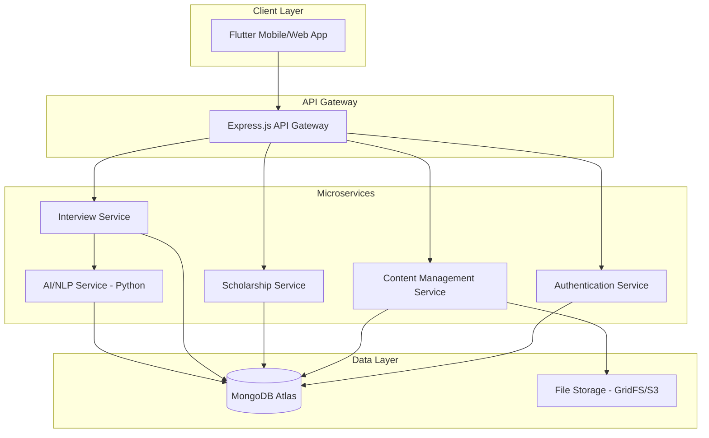

# Design Document: NovaLearn Platform

## Overview

NovaLearn is a comprehensive web-based learning platform designed exclusively for college students. The system combines educational content management, scholarship discovery, and AI-powered interview preparation in a unified platform. The architecture follows a microservices approach with a Flutter frontend, Node.js/Express backend services, MongoDB for data persistence, and Python-based NLP services for intelligent interview capabilities.

The platform emphasizes scalability, security, and user experience while providing personalized learning support through AI-driven features. The modular design allows for independent scaling and maintenance of different system components.

## Architecture

### High-Level Architecture



### Technology Stack

- **Frontend**: Flutter (Web & Mobile) with Provider/BLoC state management
- **Backend**: Node.js with Express.js framework
- **Database**: MongoDB Atlas with GridFS for file storage
- **AI/NLP**: Python with transformers, spaCy, and scikit-learn
- **Authentication**: JWT tokens with bcrypt password hashing
- **API Communication**: RESTful APIs with JSON payloads
- **Deployment**: Docker containers with cloud deployment (AWS/GCP)

## Components and Interfaces

### 1. Authentication Service

**Responsibilities:**
- User registration and login management
- JWT token generation and validation
- Password security and session management
- College credential verification

**Key Interfaces:**
```python
class AuthenticationService:
    def register_student(email: str, password: str, college_info: dict) -> AuthResult
    def authenticate_user(email: str, password: str) -> AuthResult
    def validate_token(token: str) -> TokenValidation
    def refresh_token(refresh_token: str) -> AuthResult
    def update_profile(user_id: str, profile_data: dict) -> UpdateResult
```

### 2. Content Management Service

**Responsibilities:**
- Study material organization and retrieval
- File upload and storage management
- Content categorization and tagging
- Search and recommendation functionality

**Key Interfaces:**
```python
class ContentManagementService:
    def upload_material(file_data: bytes, metadata: dict) -> UploadResult
    def get_materials_by_subject(subject: str, filters: dict) -> MaterialList
    def search_content(query: str, user_context: dict) -> SearchResults
    def get_recommendations(user_id: str) -> RecommendationList
    def organize_user_collections(user_id: str, collection_data: dict) -> CollectionResult
```

### 3. Scholarship Service

**Responsibilities:**
- Scholarship information management
- Eligibility matching algorithms
- Application guidance and deadline tracking
- Notification system for relevant opportunities

**Key Interfaces:**
```python
class ScholarshipService:
    def get_scholarships(filters: dict) -> ScholarshipList
    def match_eligibility(user_profile: dict) -> EligibilityMatches
    def get_application_guidance(scholarship_id: str) -> ApplicationGuide
    def track_deadlines(user_id: str) -> DeadlineList
    def notify_opportunities(user_id: str) -> NotificationResult
```

### 4. Interview Service

**Responsibilities:**
- Interview session management
- Question routing to AI service
- Progress tracking and analytics
- Session history and performance metrics

**Key Interfaces:**
```python
class InterviewService:
    def start_interview_session(user_id: str, domain: str) -> SessionResult
    def submit_answer(session_id: str, question_id: str, answer: str) -> SubmissionResult
    def end_session(session_id: str) -> SessionSummary
    def get_session_history(user_id: str) -> SessionHistory
    def get_performance_analytics(user_id: str) -> PerformanceMetrics
```

### 5. AI/NLP Service (Python)

**Responsibilities:**
- Role-specific question generation
- Answer evaluation and scoring
- Feedback generation with improvement suggestions
- Adaptive difficulty adjustment

**Key Interfaces:**
```python
class AIInterviewService:
    def generate_questions(domain: str, difficulty: int, count: int) -> QuestionSet
    def evaluate_answer(question: str, answer: str, context: dict) -> EvaluationResult
    def generate_feedback(evaluation: EvaluationResult) -> FeedbackReport
    def suggest_improvements(answer: str, ideal_answer: str) -> ImprovementSuggestions
    def adapt_difficulty(performance_history: list) -> DifficultyLevel
```

## Data Models

### User Model
```python
class User:
    user_id: str
    email: str
    password_hash: str
    profile: StudentProfile
    created_at: datetime
    last_login: datetime
    is_verified: bool

class StudentProfile:
    name: str
    college: str
    major: str
    year: int
    interests: list[str]
    academic_level: str
```

### Content Models
```python
class StudyMaterial:
    material_id: str
    title: str
    subject: str
    content_type: str  # pdf, video, document
    file_path: str
    metadata: MaterialMetadata
    upload_date: datetime
    access_count: int

class MaterialMetadata:
    semester: int
    difficulty_level: str
    topics: list[str]
    file_size: int
    duration: int  # for videos
```

### Scholarship Model
```python
class Scholarship:
    scholarship_id: str
    title: str
    provider: str
    amount: float
    eligibility_criteria: EligibilityCriteria
    application_deadline: datetime
    description: str
    application_link: str

class EligibilityCriteria:
    min_gpa: float
    academic_year: list[str]
    majors: list[str]
    financial_need: bool
    other_requirements: list[str]
```

### Interview Models
```python
class InterviewSession:
    session_id: str
    user_id: str
    domain: str
    start_time: datetime
    end_time: datetime
    questions: list[InterviewQuestion]
    overall_score: float
    status: str

class InterviewQuestion:
    question_id: str
    question_text: str
    expected_answer: str
    user_answer: str
    score: float
    feedback: str
    difficulty_level: int

class EvaluationResult:
    accuracy_score: float
    clarity_score: float
    relevance_score: float
    overall_score: float
    strengths: list[str]
    weaknesses: list[str]
    improvement_suggestions: list[str]
```

Now I need to use the prework tool to analyze the acceptance criteria before writing the correctness properties:
## Correctness Properties

*A property is a characteristic or behavior that should hold true across all valid executions of a system—essentially, a formal statement about what the system should do. Properties serve as the bridge between human-readable specifications and machine-verifiable correctness guarantees.*

### Authentication Properties

**Property 1: Valid credential account creation**
*For any* valid college credentials, the Authentication_System should successfully create a verified account with proper user data storage
**Validates: Requirements 1.1**

**Property 2: Authentication access grant**
*For any* correct login credentials, the Authentication_System should grant access to all platform features and maintain proper session state
**Validates: Requirements 1.2**

**Property 3: Profile update persistence**
*For any* valid profile update data, the Authentication_System should validate, store, and retrieve the updated information correctly
**Validates: Requirements 1.3**

**Property 4: Session security maintenance**
*For any* authenticated user session, the Authentication_System should maintain secure session tokens and proper session lifecycle management
**Validates: Requirements 1.4**

**Property 5: Invalid credential rejection**
*For any* invalid or malformed credentials, the Authentication_System should reject access and provide appropriate error messages
**Validates: Requirements 1.5**

**Property 6: Credential encryption**
*For any* user credentials and personal information, the Authentication_System should encrypt the data before storage and maintain encryption integrity
**Validates: Requirements 8.1**

### Content Management Properties

**Property 7: Subject material organization**
*For any* selected subject, the Content_Management_System should return relevant study materials properly organized by topics and categories
**Validates: Requirements 2.1**

**Property 8: Content search functionality**
*For any* search query with keywords, the Content_Management_System should return materials that match the search criteria and rank them by relevance
**Validates: Requirements 2.2, 6.1**

**Property 9: Material categorization consistency**
*For any* uploaded study material, the Content_Management_System should categorize it by subject, semester, and difficulty level consistently
**Validates: Requirements 2.3**

**Property 10: Content update notifications**
*For any* material update or new content addition, the Content_Management_System should notify all relevant students based on their academic profiles
**Validates: Requirements 2.4**

**Property 11: File format support**
*For any* supported file format (PDF, documents, multimedia), the Content_Management_System should successfully upload, store, and retrieve the content
**Validates: Requirements 2.5**

**Property 12: Advanced filtering functionality**
*For any* combination of filter criteria (subject, type, academic level), the Content_Management_System should return correctly filtered results
**Validates: Requirements 6.2**

**Property 13: Personal collection management**
*For any* student user, the Content_Management_System should allow creation, modification, and management of personal material collections
**Validates: Requirements 6.3**

**Property 14: Profile-based recommendations**
*For any* student's academic profile, the Content_Management_System should generate relevant content recommendations based on their interests and academic level
**Validates: Requirements 6.4**

**Property 15: History and access tracking**
*For any* user interaction with content, the Content_Management_System should maintain accurate search history and frequently accessed materials records
**Validates: Requirements 6.5**

### Scholarship Properties

**Property 16: Scholarship display completeness**
*For any* scholarship viewing request, the Content_Management_System should display current opportunities with complete eligibility criteria and application information
**Validates: Requirements 3.1**

**Property 17: Eligibility matching accuracy**
*For any* student profile, the Content_Management_System should correctly identify and highlight scholarships that match their eligibility requirements
**Validates: Requirements 3.2**

**Property 18: Application guidance provision**
*For any* scholarship entry, the Content_Management_System should provide complete application guidance and accurate deadline information
**Validates: Requirements 3.3**

**Property 19: Scholarship update propagation**
*For any* scholarship information update, the Content_Management_System should immediately reflect changes across all relevant displays and notifications
**Validates: Requirements 3.4**

**Property 20: Scholarship filtering accuracy**
*For any* combination of filter criteria (category, amount, eligibility), the Content_Management_System should return scholarships that match all specified filters
**Validates: Requirements 3.5**

### AI Interview Properties

**Property 21: Domain-specific question generation**
*For any* selected interview domain, the AI_Interviewer should generate questions that are relevant and appropriate to that specific role or field
**Validates: Requirements 4.1**

**Property 22: Answer evaluation consistency**
*For any* student answer to interview questions, the AI_Interviewer should evaluate response quality, relevance, and accuracy using consistent criteria
**Validates: Requirements 4.2**

**Property 23: Improvement suggestion provision**
*For any* evaluated answer, the AI_Interviewer should provide specific, actionable improvement suggestions or correct answer alternatives
**Validates: Requirements 4.3**

**Property 24: Comprehensive session feedback**
*For any* completed interview session, the Feedback_System should generate comprehensive performance feedback covering all evaluation dimensions
**Validates: Requirements 4.4**

**Property 25: Adaptive difficulty adjustment**
*For any* ongoing interview session, the AI_Interviewer should adjust question difficulty based on the student's performance patterns during the session
**Validates: Requirements 4.5**

### Feedback System Properties

**Property 26: Multi-dimensional answer assessment**
*For any* answer evaluation, the Feedback_System should assess content accuracy, communication clarity, and relevance as separate measurable dimensions
**Validates: Requirements 5.1**

**Property 27: Specific improvement suggestions**
*For any* evaluated answer, the Feedback_System should provide specific, actionable improvement suggestions tailored to the identified weaknesses
**Validates: Requirements 5.2**

**Property 28: Balanced feedback generation**
*For any* response evaluation, the Feedback_System should highlight both strengths and areas for improvement in a balanced manner
**Validates: Requirements 5.3**

**Property 29: Progress tracking continuity**
*For any* sequence of interview sessions by the same user, the Feedback_System should maintain accurate progress tracking and performance trend analysis
**Validates: Requirements 5.4**

**Property 30: Personalized recommendation generation**
*For any* user's performance history, the Feedback_System should generate personalized recommendations that address their specific improvement areas
**Validates: Requirements 5.5**

### Security and Privacy Properties

**Property 31: Interview data anonymization**
*For any* stored interview session data, the Content_Management_System should anonymize sensitive student information while preserving analytical value
**Validates: Requirements 8.2**

**Property 32: Role-based access control**
*For any* user with a specific role, the Content_Management_System should enforce access permissions that match their role and prevent unauthorized access
**Validates: Requirements 8.3**

**Property 33: Breach notification system**
*For any* detected security breach scenario, the Authentication_System should immediately trigger notifications to all affected users with appropriate breach details
**Validates: Requirements 8.4**

## Error Handling

### Authentication Errors
- **Invalid Credentials**: Return structured error responses with specific failure reasons
- **Session Expiry**: Implement automatic token refresh with graceful fallback to re-authentication
- **Account Lockout**: Implement progressive delays for repeated failed login attempts
- **Verification Failures**: Provide clear guidance for college credential verification issues

### Content Management Errors
- **File Upload Failures**: Handle file size limits, format restrictions, and storage errors gracefully
- **Search Timeouts**: Implement search result caching and fallback mechanisms
- **Content Not Found**: Provide helpful suggestions and alternative content recommendations
- **Permission Denied**: Clear messaging about access restrictions and upgrade paths

### AI Service Errors
- **Model Unavailability**: Fallback to cached questions and pre-generated feedback when AI services are down
- **Evaluation Failures**: Graceful degradation to basic scoring when advanced NLP evaluation fails
- **Generation Timeouts**: Implement timeout handling with partial results and retry mechanisms
- **Invalid Input Handling**: Sanitize and validate all user inputs before processing

### Data Consistency Errors
- **Concurrent Updates**: Implement optimistic locking for user profile and session data
- **Sync Failures**: Retry mechanisms with exponential backoff for database operations
- **Partial Failures**: Transaction rollback and compensation patterns for multi-service operations

## Testing Strategy

### Dual Testing Approach

The NovaLearn platform will employ both unit testing and property-based testing to ensure comprehensive coverage and correctness validation.

**Unit Tests** will focus on:
- Specific examples of authentication flows and edge cases
- Individual API endpoint behavior with known inputs
- Error condition handling and boundary value testing
- Integration points between microservices
- Database operation validation with specific test data

**Property-Based Tests** will verify:
- Universal properties that hold across all valid inputs
- Correctness properties defined in this design document
- System behavior under randomized input conditions
- Data integrity and consistency across operations
- Security properties under various attack scenarios

### Property-Based Testing Configuration

**Framework Selection**: 
- **Python services**: Use Hypothesis for property-based testing
- **Node.js services**: Use fast-check for property-based testing
- **Integration tests**: Use Hypothesis for end-to-end property validation

**Test Configuration**:
- Minimum 100 iterations per property test to ensure statistical confidence
- Each property test must reference its corresponding design document property
- Tag format: **Feature: nova-learn-platform, Property {number}: {property_text}**
- Custom generators for domain-specific data (student profiles, interview questions, etc.)

**Property Test Implementation**:
- Each correctness property must be implemented as a single property-based test
- Tests should generate realistic data using smart generators that understand domain constraints
- Focus on testing core business logic without excessive mocking
- Property tests should validate the universal quantification statements from the design properties

### Testing Coverage Requirements

**Authentication Service**:
- Property tests for all credential validation and session management properties
- Unit tests for specific authentication flows and error scenarios
- Security testing for encryption and token validation

**Content Management Service**:
- Property tests for search, filtering, and recommendation algorithms
- Unit tests for file upload/download operations and specific content scenarios
- Performance testing for content delivery and search response times

**AI/NLP Service**:
- Property tests for question generation and answer evaluation consistency
- Unit tests for specific interview scenarios and feedback generation
- Model validation tests for NLP accuracy and bias detection

**Integration Testing**:
- End-to-end property tests for complete user workflows
- API contract testing between microservices
- Data consistency validation across service boundaries

The testing strategy ensures that both specific examples work correctly (unit tests) and that universal properties hold across all possible inputs (property tests), providing comprehensive validation of system correctness and reliability.